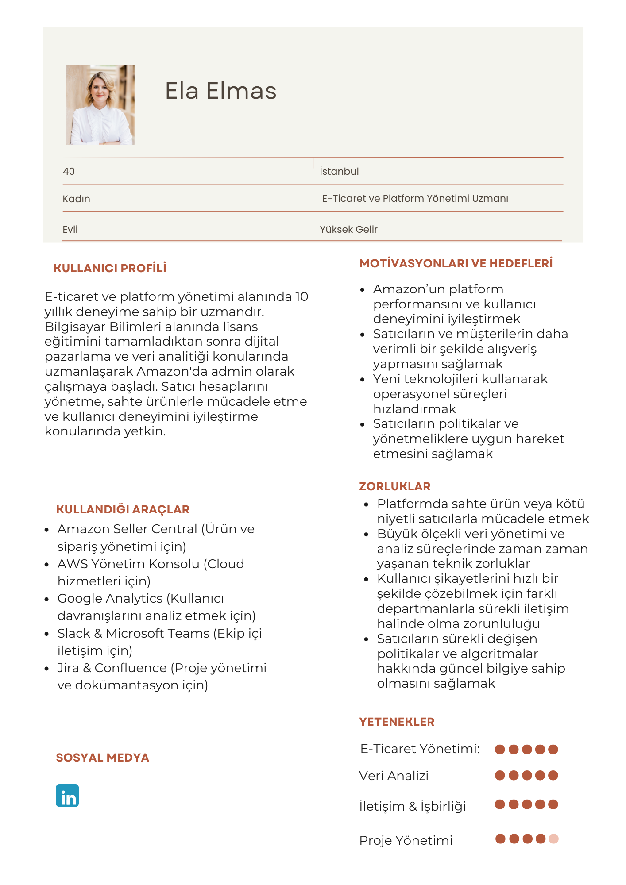

# business-analysis-projects

# Amazon - Business Analysis

This project analyzes the Amazon e-commerce experience from a business analysis perspective, including persona creation, user story mapping, and mockup design.

### Persona 1 – E-Commerce & Platform Manager

📎 [View full Figma design](https://www.canva.com/design/DAGglpKLgJc/GOH18RI9T_xHAcyvJLsw8g/view)

A professional managing e-commerce operations, focused on efficient product management, inventory tracking, and smooth platform workflows.

I created a User Story Map to visualize the main user flows and prioritize features of the Amazon e-commerce experience.
This map helped structure the product backlog and identify core functionalities such as browsing, adding to cart, and checkout.

📎 [View full Figma design]([https://www.figma.com/design/JaBpx4Qn009EzlkUhKkGoh/User-Story-Mapping--Copy-?node-id=35692-13101&p=f&t=3IKb7vyHQZ2tbEM7-0](https://www.figma.com/design/JaBpx4Qn009EzlkUhKkGoh/User-Story-Mapping--Copy-?node-id=35652-5047&p=f&t=ca7rL0HuuV73nCPr-0))

